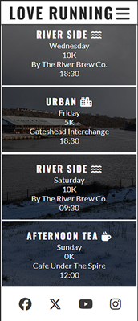

# Code Along Project - Love Running

[Love Running](https://ktay0557.github.io/love_running/)

This is a code along project run by Code Institute, to create a website for users who love running.

The site was written using mobile first design, with responsiveness added in once it was fully functional on mobile phones.

