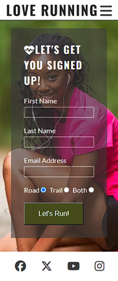
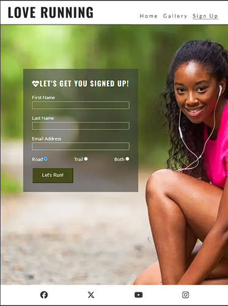

# Code Along Project - Love Running

[Love Running](https://ktay0557.github.io/love_running/)

This is a code along project run by Code Institute, to create a website for users who love running.

The site was written using mobile first design, with responsiveness added in once it was fully functional on mobile phones.

There are multiple pages, providing the user with details of the various runs available,
images from current runners participating in runs, and a sign up page to allow new users to join.

## User Experience (UX)

### User stories

- Goals for First Time Visitors:

  - As a newcomer to the site, I want to be able to easily find information of upcoming runs.

  - As a newcomer to the site, I want to be able to easily navigate the site and be able to interact with the site.
  
  - As a newcomer to the site, I want to be able to easily sign up as a member to the upcoming runs.

- Goals for Returning Visitors:

  - Being a returning visitor, I am interested in checking whether there are any upcoming meets.

  - Being a returning visitor, I want to look through images of previous runs.
  
- Goals for Regular Users:

  - As a regular user, I want to keep up to date with upcoming runs and social events.

## Technologies Used

### Languages Used

- HTML
- CSS

### Frameworks, Libraries, and Programs Used

1. GitHub:
   - GitHub is used to store the project codes after being pushed from Codeanywhere.
2. Git:
   - Git is used for version control, to enable commits to Git and the ability to Push to GitHub.
3. Google Fonts:
   - Google Fonts was used throughout the website, for aesthetic purposes in regards to the text.
4. Hover.css:
   - Hover.css was used the highlight the menu choices when the cursor hovers over them.

## Testing

The project was validated using the W3C Markup and CSS Validators, in order to ensure that the project contained no errors.

The W3C CSS Validator gave a warning in regards to a missing section heading on the Gallery page. A hidden heading was added to ensure the layout was not compromised.

In the future, I would like to add the ability for users to post their own images with a feature to comment on the images.

## Testing User Stories from the UX Section

- Goals for First Time Visitors:

  - As a newcomer to the site, I want to be able to easily find information of upcoming runs.

      a. Once the user has entered the site, upcoming runs can be found on the landing page.

  - As a newcomer to the site, I want to be able to easily navigate the site and be able to interact with the site.

      a. There is a responsive navigation menu which allows the user to explore different pages of the site.

  - As a newcomer to the site, I want to be able to easily sign up as a member to the upcoming runs.

      a. The simple and clearly labelled Sign Up Form can be found on the navigation menu, and provides the user a way of signing up for upcoming runs.

- Goals for Returning Visitors:

  - Being a returning visitor, I am interested in checking whether there are any upcoming meets.

      a. As with newcomers, a returning visitor will be able to see upcoming runs from the landing page.

  - Being a returning visitor, I want to look through images of previous runs.

      a. The Gallery page allows visitors to the site, the ability to look at images from previous runs.
  
- Goals for Regular Users:

  - As a regular user, I want to keep up to date with upcoming runs and social events.

      a. Regular users are able to keep up to date with upcoming events by checking the landing page for information.

## Deployment

### GitHub Pages

The project was deployed to GitHub Pages using the following steps:

    1. Logged into GitHub and went to the specific GitHub Repository.
    2. In the Repository page, clicked on the "Settings" cog at the top of the page.
    3. In the "Code and automation" area, selected "Pages".
    4. Under "Source" option, choose "Deploy from a branch", followed by "main" and "/(root)".
    5. Refreshed the page, and at the top of the page is the published site link within "GitHub Pages" area.

### Forking the GitHub Repository

By forking the GitHub Repository, a copy can be created. This allows for viewing and editing, without affecting the original. The following steps show how:

    1. Log into GitHub, locate the GitHub Repository.
    2. "Fork" is towards the top of the page, select it.
    3. This provides a copy of the original repository.

### Making a Local Clone

    1. Start by logging into GitHub.
    2. Locate the required GitHub Repository.
    3. Click the "<> Code" dropdown option.
    4. The link can be copied and cloned. 

## Credits

### Code

- Code Institute: The Love Running Project modules provided code along videos to help create the project.

### Content

- All content was written by the developer, using step-by-step code along videos from Code Institute.

### Media

- All images were provided by Code Institute, with the exception of the upcoming runs section on the home page, which was taken by the developer.

### Acknowledgements

- Code Institute for the very helpful bitesized code along lessons.
- Kevin for always being there for me.
